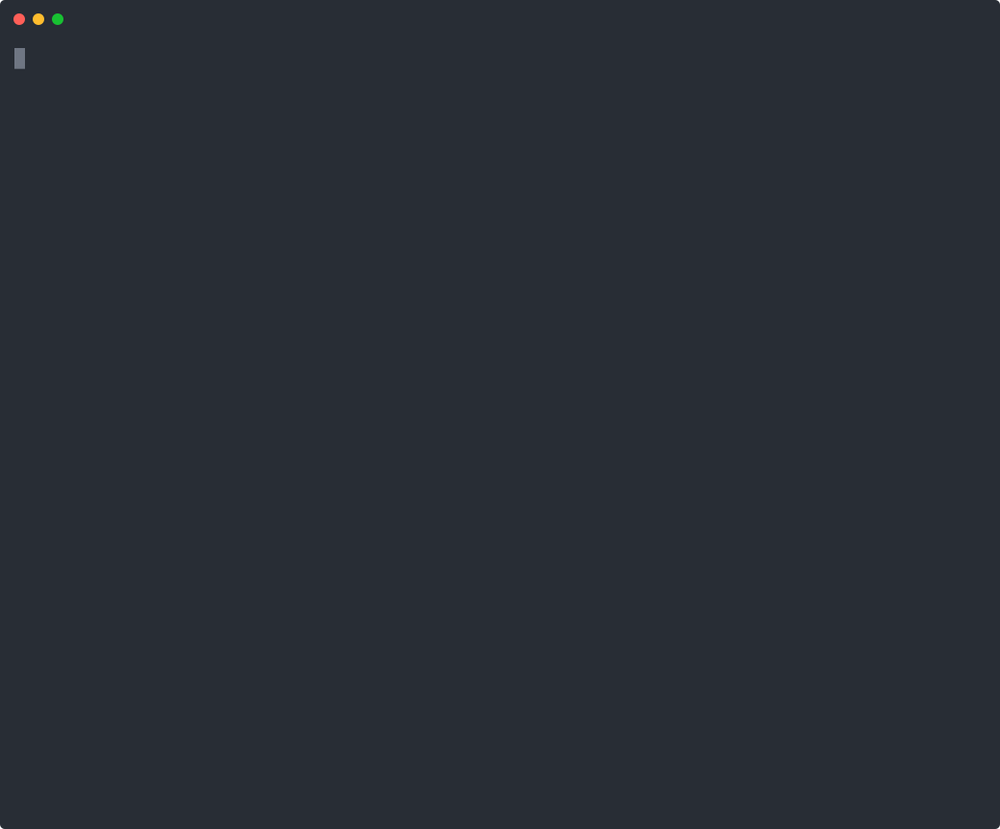

# microcodegen.py

**PRD text → a running Flask app → ZIP bytes. One Python file, zero dependencies.**

Inspired by Andrej Karpathy's [micrograd](https://github.com/karpathy/micrograd) — this is the core Archiet algorithm in its simplest form.

[](https://archiet.com)

> Every line of output above is from a real run. Reproduce it yourself in one command: [`./demo.sh`](demo.sh).

```bash
python microcodegen.py examples/task_manager.md --out ./my-task-app
cd my-task-app && cp .env.example .env
docker compose up           # Flask + Postgres, healthcheck-gated
curl localhost:5000/api/health
```

→ A **working, bootable Flask app** with JWT-cookie auth and per-tenant CRUD at `http://localhost:5000`.

---

## What it generates from your PRD

Given a plain-English Product Requirements Document, `microcodegen.py` outputs a complete Flask application (25 files for the example PRD):

- **Flask app factory** (`app/__init__.py` → `create_app`) with a `wsgi.py`/gunicorn entrypoint — boots as-is
- **Flask-SQLAlchemy models** — one per entity extracted from your PRD, each with a `user_id` FK and `to_dict()`
- **JWT-cookie auth** — `/api/auth/register`, `/login`, `/logout`, `/me` via flask-jwt-extended; tokens live in **httpOnly cookies**, never localStorage
- **Full CRUD blueprints** — list, create, get, update, delete per entity; every route is `@jwt_required()`
- **Per-tenant data isolation** — every row has a `user_id`; every query is `filter_by(user_id=get_jwt_identity())`; no cross-user leaks. Writes go through a writable-field allowlist so a client can't spoof `user_id`
- **JSON error handlers** (400/401/404/405/500) so the API never returns HTML
- **CORS scoped to `FRONTEND_URL`** (not wildcard), with credentials support
- **A boot-time secret check** — `config.py` refuses to start if `SECRET_KEY`/`JWT_SECRET_KEY` are missing or still a `change-me` placeholder
- **docker-compose.yml** — Postgres 16 with a healthcheck-gated app start
- **A click-through demo page** (`app/static/index.html`) served at `/` — register/login/CRUD in the browser, no frontend to write
- **pytest suite** — Flask test client smoke tests
- **GENOME.json** — the architectural IR the app was rendered from

Schema is created with `db.create_all()` on first boot — this minimal file ships no migrations (the full platform adds Alembic). Zero LLM calls. Zero API keys. Pure Python stdlib.

---

## Run it

```bash
# Python 3.10+
git clone https://github.com/Anioko/microcodegen
cd microcodegen

# Generate from an example PRD
python microcodegen.py examples/task_manager.md --out ./my-task-app

# Boot it (needs Docker for the bundled Postgres)
cd my-task-app
cp .env.example .env
docker compose up
# → http://localhost:5000   (and the API at /api/health)
```

End-to-end in three curls (register → create → list):

```bash
curl -c cookies.txt -X POST localhost:5000/api/auth/register \
     -H 'Content-Type: application/json' \
     -d '{"email":"you@example.com","password":"hunter22hunter"}'

curl -b cookies.txt -X POST localhost:5000/api/projects/ \
     -H 'Content-Type: application/json' \
     -d '{"name":"My first project"}'

curl -b cookies.txt localhost:5000/api/projects/
```

Or just run the whole thing — generate, boot, and walk the auth+CRUD flow:

```bash
./demo.sh
```

Or pipe the ZIP:

```bash
python microcodegen.py examples/task_manager.md > app.zip
```

Or install from PyPI:

```bash
pip install archiet-microcodegen
archiet-microcodegen examples/task_manager.md --out ./my-task-app
```

---

## Write your own PRD

```markdown
# Project Tracker

## Entities
- Project: name (string, required), description (text), status (string)
- Task: title (string, required), completed (boolean), due_date (datetime)
- Comment: body (text, required)

## User Stories
- As a developer, I want to manage projects so that I can track my work.
- As a developer, I want to add tasks to projects so that I can break work into steps.
```

Save as `prd.md`, run:

```bash
python microcodegen.py prd.md --out ./my-app
```

---

## The four stages

```
PRD text  (your requirements document)
   │
   ▼  Stage 1: parse_prd(text) → manifest
   │  Pure regex extraction — entities, fields, user stories, integrations.
   │  No LLM. Misses subtle PRDs; that's acceptable for a spec reference.
   │
   ▼  Stage 2: manifest_to_genome(manifest) → genome
   │  Converts the manifest into a stack-neutral architectural genome dict —
   │  the intermediate representation that drives rendering. One module per
   │  entity, plus inferred integrations.
   │
   ▼  Stage 3: render_genome(genome) → {path: content}
   │  string.Template substitution over embedded Flask templates.
   │  Outputs the app factory, Flask-SQLAlchemy models, JWT-cookie auth,
   │  CRUD blueprints, config, docker-compose, tests, and a demo page.
   │
   ▼  Stage 4: pack(files) → ZIP bytes
      stdlib zipfile.ZipFile. Download it, push it to GitHub, deploy it.
```

---

## Why one file?

The same philosophy as [micrograd](https://github.com/karpathy/micrograd) and [minGPT](https://github.com/karpathy/minGPT):

> *If you can't express the core algorithm in a single file, you're hiding behind layers.*

`microcodegen.py` serves three purposes:
1. **Onboarding** — a new engineer understands what Archiet *is* in 10 minutes
2. **Regression check** — a bug that doesn't repro here is in the efficiency layers, not the algorithm
3. **Spec** — any algorithmic change (new genome key, new manifest field) updates this file first

---

## What this file does NOT include

This is the minimum viable PRD→code pipeline: one stack (Flask), regex extraction, no quality gate. Production use cases need more:

| Feature | Where it lives |
|---|---|
| LLM-powered PRD extraction (handles natural language) | [archiet.com](https://archiet.com) |
| **9 backend stacks**: FastAPI, NestJS, Django, Go (chi), Java Spring Boot, .NET, Laravel, Rails | [archiet.com](https://archiet.com) |
| React/Next.js frontend (shadcn/ui, auth pages, onboarding) | [archiet.com](https://archiet.com) |
| Expo mobile app (iOS + Android, push notifications) | [archiet.com](https://archiet.com) |
| Alembic migrations instead of `db.create_all` | [archiet.com](https://archiet.com) |
| ArchiMate 3.2 element map + ADR / TOGAF architecture docs | [archiet.com](https://archiet.com) |
| Compliance artifact packs — SOC 2, HIPAA, GDPR, PCI-DSS control matrices | [archiet.com](https://archiet.com) |
| 13-gate shippability audit (security scan, import coherence, boot test) | [archiet.com](https://archiet.com) |
| GitHub push + drift detection + architecture scoring | [archiet.com](https://archiet.com) |
| Quality score ≥ 80 gate (delivery blocked on broken output) | [archiet.com](https://archiet.com) |

**[Free plan at archiet.com](https://archiet.com)** — 1 full app per month, no credit card.

---

## Architecture deep dive

### Stage 1 — `parse_prd(text) → manifest`

Pure regex extraction across four pattern classes:

- `_ENTITY_PATTERN` — finds entity section headers (`## Entities`, `## Data Models`)
- `_ENTITY_NAME_PATTERN` — finds entity names as list items or sub-headers
- `_FIELD_PATTERN` — finds `- fieldname: type (modifiers)` declarations
- `_USER_STORY_PATTERN` — finds `As a X, I want Y so that Z.` sentences

The full Archiet pipeline replaces this with a chunked LLM extractor (overlap + dedup merge) that handles PRDs that don't follow a rigid format. The algorithm shape is identical — only the extraction quality changes.

### Stage 2 — `manifest_to_genome(manifest) → genome`

Converts the manifest into a **genome** — the stack-neutral intermediate representation that drives all downstream rendering.

The genome encodes:
- `language` — `flask` (this file's scope; the full system supports 9+ stacks)
- `modules[]` — one module per entity, with its fields and user stories
- `integrations[]` — inferred from vendor mentions (Stripe, Auth0, SendGrid, etc.)

The full platform additionally types every element to ArchiMate 3.2 and threads it through governance and compliance — out of scope for this single file.

### Stage 3 — `render_genome(genome) → {path: content}`

`string.Template` substitution across templates embedded directly in the file. Each template is a complete source file with `$variable` placeholders.

Files emitted for every generated app:

- `wsgi.py` — gunicorn entrypoint (`from app import create_app`)
- `app/__init__.py` — the Flask app factory: blueprint wiring, JWTManager, CORS, JSON error handlers, `db.create_all()` on boot
- `app/database.py` — the Flask-SQLAlchemy `db` instance
- `app/blueprints/auth_bp.py` — register / login / logout / me, JWT in httpOnly cookies
- `app/models/user.py` — User model with password hashing
- `config.py` — env-driven config that refuses to boot on placeholder secrets
- `docker-compose.yml` + `Dockerfile` — Postgres 16 + gunicorn, healthcheck-gated
- `app/static/index.html` — a single-page register/login/CRUD demo
- `tests/` — pytest + Flask test client
- `.env.example`, `requirements.txt`, `README.md`, `GENOME.json`

Per entity:
- `app/models/<entity>.py` — Flask-SQLAlchemy model with a `user_id` FK and `to_dict()`
- `app/blueprints/<entity>_bp.py` — full CRUD blueprint, all routes `@jwt_required()`, per-tenant scoped

### Stage 4 — `pack(files) → bytes`

`zipfile.ZipFile(DEFLATED)`. Maps `{path: content}` → ZIP bytes. The customer downloads this ZIP and runs it.

---

## Examples

See [`examples/`](examples/) for sample PRDs:

- [`task_manager.md`](examples/task_manager.md) — project/task management SaaS
- [`saas_billing.md`](examples/saas_billing.md) — subscription billing with Stripe
- [`ecommerce.md`](examples/ecommerce.md) — product catalog + orders

---

## Contributing

The algorithm is intentionally simple. Before adding features, ask:

> *"Is this part of how a PRD becomes shippable code? Or is it tuning, fallback, or quality?"*

If the former, open a PR. If the latter, it belongs in the full Archiet pipeline.

---

## License

MIT. Use it, fork it, learn from it.

The production platform (9+ stacks, compliance packs, quality gates, GitHub push) is commercial: **[archiet.com](https://archiet.com)**
